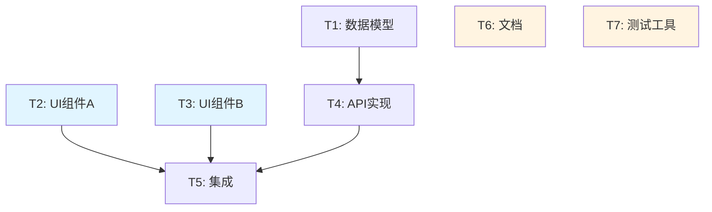

# [功能名称] - 实施计划

> 本文档基于 `prd.md`、`cases.md` 和 `design.md` 生成，定义可执行的任务清单。

## 概述

- **PRD 文档**：[prd.md](./prd.md)
- **测试场景**：[cases.md](./cases.md)
- **技术设计**：[design.md](./design.md)
- **计划日期**：YYYY-MM-DD

**目标**：[一句话描述要实现什么]

**技术栈**：[关键技术，来自 design.md]

---

## 任务依赖图



**图例**：
- 蓝色：并行组 A（前端）
- 黄色：并行组 B（独立任务）
- 白色：串行任务

---

## 并行执行建议

### 阶段 1：并行开发（可同时进行）

**并行组 A - 前端开发**
- T2: UI 组件 A
- T3: UI 组件 B

**并行组 B - 后端开发**
- T1: 数据模型
- T4: API 实现

**并行组 C - 独立任务**
- T6: 文档编写
- T7: 测试工具配置

### 阶段 2：集成（串行，依赖阶段 1）

- T5: 前后端集成测试

**执行方式**：
- **单人开发**：按并行组顺序执行，或选择一个组先完成
- **多 worktree**：为每个并行组创建独立 worktree
- **多 agent**：为每个并行组分配独立 agent

---

## 任务清单

### T1: [任务名称]

**元信息**：
- **编号**：T1
- **依赖**：无
- **并行组**：B（后端开发）
- **预计时间**：10 分钟
- **覆盖场景**：TC-PARAM-001, TC-DATA-001
- **潜在冲突**：无

**文件清单**：
- 创建：`src/models/[Model].ts`
- 创建：`tests/unit/models/[Model].test.ts`

**实现步骤**：

1. **编写测试**
   - 创建测试文件 `tests/unit/models/[Model].test.ts`
   - 测试用例：实例创建、字段验证、边界条件

2. **运行测试确认失败**
   ```bash
   npm test -- tests/unit/models/[Model].test.ts
   ```
   预期：FAIL - "[Model] is not defined"

3. **实现功能**
   - 创建 `src/models/[Model].ts`
   - 实现数据模型类
   - 添加字段验证逻辑

4. **运行测试确认通过**
   ```bash
   npm test -- tests/unit/models/[Model].test.ts
   ```
   预期：PASS - 所有测试通过

5. **提交代码**
   ```bash
   git add src/models/[Model].ts tests/unit/models/[Model].test.ts
   git commit -m "feat: add [Model] data model

   Implements [Model] with field validation.
   Covers: TC-PARAM-001, TC-DATA-001"
   ```

---

### T2: [任务名称]

**元信息**：
- **编号**：T2
- **依赖**：无
- **并行组**：A（前端开发）
- **预计时间**：15 分钟
- **覆盖场景**：TC-PARAM-002, TC-A11Y-001
- **潜在冲突**：可能与 T3 同时修改 `src/components/index.ts`

**文件清单**：
- 创建：`src/components/[Component]/[Component].tsx`
- 创建：`src/components/[Component]/[Component].test.tsx`
- 修改：`src/components/index.ts`（添加导出）

**实现步骤**：

1. **编写测试**
   - 创建测试文件 `src/components/[Component]/[Component].test.tsx`
   - 测试用例：渲染正确性、键盘可访问性

2. **运行测试确认失败**
   ```bash
   npm test -- src/components/[Component]/[Component].test.tsx
   ```
   预期：FAIL - "[Component] is not defined"

3. **实现功能**
   - 创建 `src/components/[Component]/[Component].tsx`
   - 实现组件逻辑
   - 确保键盘可访问性（tabIndex, role 等）
   - 在 `src/components/index.ts` 中添加导出

4. **运行测试确认通过**
   ```bash
   npm test -- src/components/[Component]/[Component].test.tsx
   ```
   预期：PASS - 所有测试通过

5. **提交代码**
   ```bash
   git add src/components/[Component]/ src/components/index.ts
   git commit -m "feat: add [Component] component

   Implements [Component] with keyboard accessibility.
   Covers: TC-PARAM-002, TC-A11Y-001"
   ```

---

### T3: [任务名称]

[同上格式]

---

### T4: [任务名称]

**元信息**：
- **编号**：T4
- **依赖**：T1（需要数据模型）
- **并行组**：B（后端开发）
- **预计时间**：15 分钟
- **覆盖场景**：TC-PARAM-003, TC-SEC-001, TC-FAULT-001
- **潜在冲突**：无

[同上格式]

---

### T5: [任务名称]

**元信息**：
- **编号**：T5
- **依赖**：T2, T3, T4（需要前后端组件完成）
- **并行组**：无（串行任务）
- **预计时间**：20 分钟
- **覆盖场景**：TC-FLOW-001, TC-FLOW-002
- **潜在冲突**：无

[同上格式]

---

## 场景覆盖矩阵

| 场景编号 | 场景类型 | 对应任务 | 状态 |
|----------|----------|----------|------|
| TC-PARAM-001 | 参数组合 | T1 | 待实现 |
| TC-PARAM-002 | 参数组合 | T2 | 待实现 |
| TC-PARAM-003 | 参数组合 | T4 | 待实现 |
| TC-STATE-001 | 状态转换 | T4 | 待实现 |
| TC-FAULT-001 | 故障场景 | T4 | 待实现 |
| TC-SEC-001 | 安全 | T4 | 待实现 |
| TC-A11Y-001 | 可访问性 | T2 | 待实现 |
| TC-FLOW-001 | 用户流程 | T5 | 待实现 |
| TC-FLOW-002 | 用户流程 | T5 | 待实现 |

**覆盖统计**：
- 总场景数：[X]（来自 cases.md）
- 已规划：[Y]
- 覆盖率：[Y/X * 100]%

---

## 执行检查清单

### 开始前

- [ ] 确认所有依赖已安装
- [ ] 确认测试环境正常
- [ ] 如果并行开发，创建对应的 worktree

### 执行中

- [ ] 严格按照任务顺序执行（注意依赖关系）
- [ ] 每个任务完成后立即提交
- [ ] 遇到阻塞立即停止并寻求帮助
- [ ] 定期运行完整测试套件

### 完成后

- [ ] 所有测试通过
- [ ] 代码已提交
- [ ] 文档已更新
- [ ] 准备代码审查或合并

---

## 注意事项

### 潜在冲突

以下任务可能同时修改相同文件，如果并行开发需要注意：

| 任务组合 | 冲突文件 | 建议 |
|----------|----------|------|
| T2, T3 | `src/components/index.ts` | 串行执行或手动合并 |

### 技术风险

| 风险 | 影响任务 | 缓解措施 |
|------|----------|----------|
| [风险描述] | T1, T2 | [缓解措施] |

---

## 附录

### 相关命令

```bash
# 运行所有测试
npm test

# 运行特定测试文件
npm test -- path/to/test.ts

# 运行测试覆盖率
npm test -- --coverage

# 构建项目
npm run build

# 启动开发服务器
npm run dev
```

### 参考资料

- [参考资料 1]
- [参考资料 2]

