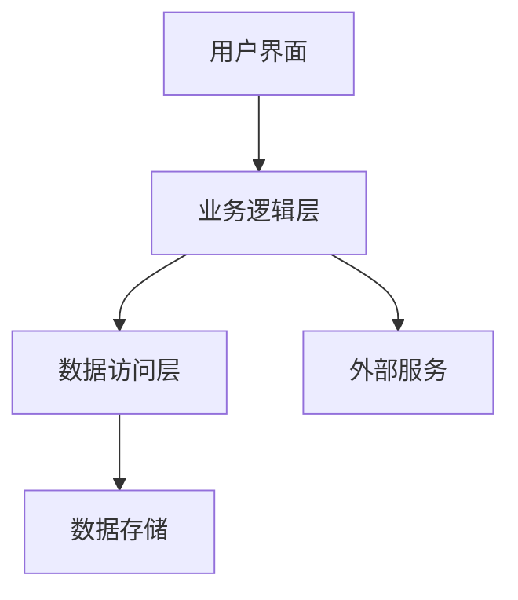
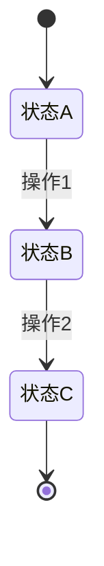
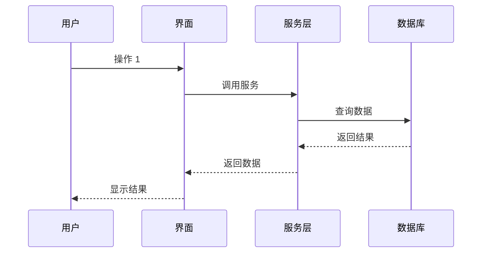

# [功能名称] - 技术设计

> 本文档基于 `prd.md` 和 `cases.md` 生成，定义技术实现方案。

## 概述

- **PRD 文档**：[prd.md](./prd.md)
- **测试场景**：[cases.md](./cases.md)
- **设计日期**：YYYY-MM-DD

---

## 1. 技术栈

| 类别 | 技术选择 | 版本 | 说明 |
|------|----------|------|------|
| 语言 | [如 TypeScript] | [如 5.x] | [用途说明] |
| 框架 | [如 React] | [如 18.x] | [用途说明] |
| 状态管理 | [如 Zustand] | [如 4.x] | [用途说明] |
| UI 组件库 | [如 shadcn/ui] | [如 latest] | [用途说明] |
| 测试框架 | [如 Vitest] | [如 1.x] | [用途说明] |
| 构建工具 | [如 Vite] | [如 5.x] | [用途说明] |

**核心依赖**：
- [依赖 1]：[用途]
- [依赖 2]：[用途]

---

## 2. 架构设计

### 系统架构



### 模块划分

| 模块名称 | 职责 | 依赖模块 | 覆盖场景 |
|----------|------|----------|----------|
| [模块 1] | [职责描述] | [依赖的其他模块] | TC-PARAM-001, TC-STATE-001 |
| [模块 2] | [职责描述] | [依赖的其他模块] | TC-FAULT-001, TC-SEC-001 |
| [模块 3] | [职责描述] | [依赖的其他模块] | TC-PERF-001 |

### 目录结构

```
项目根目录/
├── src/                    # 源代码
│   ├── components/         # UI 组件
│   │   ├── [Component1]/   # 组件 1
│   │   └── [Component2]/   # 组件 2
│   ├── services/           # 业务逻辑
│   │   ├── [Service1].ts   # 服务 1
│   │   └── [Service2].ts   # 服务 2
│   ├── models/             # 数据模型
│   │   └── [Model].ts      # 模型定义
│   ├── utils/              # 工具函数
│   │   └── [util].ts       # 工具函数
│   └── types/              # 类型定义
│       └── [types].ts      # 类型文件
├── tests/                  # 测试代码
│   ├── unit/               # 单元测试
│   ├── integration/        # 集成测试
│   └── e2e/                # 端到端测试
└── docs/                   # 文档
```

**目录说明**：
- `src/components/`：[说明]
- `src/services/`：[说明]
- `src/models/`：[说明]

---

## 3. 数据模型

> 如果不涉及数据处理，可省略此部分

### 核心实体

#### [实体 1]

**用途**：[实体的业务含义]

**关键属性**：
- `id`：唯一标识符
- `[属性 1]`：[属性说明]
- `[属性 2]`：[属性说明]
- `[属性 3]`：[属性说明]

**关系**：
- 与 [实体 2] 的关系：[一对一/一对多/多对多]

**覆盖场景**：TC-PARAM-001, TC-DATA-001

#### [实体 2]

**用途**：[实体的业务含义]

**关键属性**：
- `id`：唯一标识符
- `[属性 1]`：[属性说明]

**覆盖场景**：TC-PARAM-002

### 状态管理

> 如果涉及状态转换，添加此部分



**状态定义**：

| 状态名称 | 说明 | 允许的操作 | 覆盖场景 |
|----------|------|------------|----------|
| [状态 A] | [状态说明] | [操作 1, 操作 2] | TC-STATE-001 |
| [状态 B] | [状态说明] | [操作 2, 操作 3] | TC-STATE-002 |
| [状态 C] | [状态说明] | [操作 3] | TC-STATE-003 |

---

## 4. 接口设计

> 如果不涉及 API 或模块接口，可省略此部分

### 对外接口

#### [接口/端点 1]

**用途**：[接口用途]

**输入**：
- `[参数 1]`：[类型] - [说明]
- `[参数 2]`：[类型] - [说明]

**输出**：
- 成功：[返回格式说明]
- 失败：[错误格式说明]

**错误处理**：
- [错误码 1]：[错误说明]
- [错误码 2]：[错误说明]

**覆盖场景**：TC-PARAM-001, TC-SEC-001, TC-FAULT-002

#### [接口/端点 2]

[同上格式]

### 模块接口

#### [模块名称]

**暴露接口**：
- `[方法 1]`：[用途说明]
- `[方法 2]`：[用途说明]

**职责**：[模块职责说明]

**依赖**：[依赖的其他模块]

**覆盖场景**：TC-PARAM-001, TC-STATE-001

---

## 5. 关键流程

### 流程 1：[流程名称]

**业务场景**：[流程的业务背景]

**流程图**：



**步骤说明**：
1. [步骤 1 说明]
2. [步骤 2 说明]
3. [步骤 3 说明]

**异常处理**：
- 如果 [异常情况 1]：[处理方式]
- 如果 [异常情况 2]：[处理方式]

**覆盖场景**：TC-FLOW-001, TC-FAULT-001

### 流程 2：[流程名称]

[同上格式]

---

## 6. 非功能性设计

> 根据 cases.md 中的场景类型，选择性包含以下部分

### 性能设计

> 仅在包含 TC-PERF-* 场景时添加

**性能目标**：
- 响应时间：P95 < [X]ms
- 吞吐量：> [X] req/s
- 并发支持：[X] 并发用户

**优化策略**：
- [策略 1]：[具体做法]
- [策略 2]：[具体做法]

**覆盖场景**：TC-PERF-001, TC-PERF-002

### 安全设计

> 仅在包含 TC-SEC-* 场景时添加

**安全措施**：

| 安全类型 | 防护措施 | 覆盖场景 |
|----------|----------|----------|
| 输入验证 | [具体措施] | TC-SEC-001 |
| 认证授权 | [具体措施] | TC-SEC-003 |
| 数据加密 | [具体措施] | TC-SEC-004 |
| CSRF 防护 | [具体措施] | TC-SEC-004 |

### 兼容性设计

> 仅在包含 TC-COMPAT-* 场景时添加

**兼容性策略**：

| 兼容性类型 | 支持范围 | 实现方式 | 覆盖场景 |
|------------|----------|----------|----------|
| 浏览器 | [支持的浏览器列表] | [如 polyfill、特性检测] | TC-COMPAT-001~003 |
| 操作系统 | [支持的操作系统] | [如条件编译] | TC-COMPAT-004~005 |
| 移动设备 | [支持的设备] | [如响应式设计] | TC-COMPAT-006~007 |

### 可访问性设计

> 仅在包含 TC-A11Y-* 场景时添加

**可访问性措施**：

| 措施类型 | 具体实现 | 覆盖场景 |
|----------|----------|----------|
| 键盘导航 | [实现方式] | TC-A11Y-001 |
| 屏幕阅读器 | [实现方式] | TC-A11Y-002 |
| 颜色对比度 | [实现方式] | TC-A11Y-003 |
| 焦点管理 | [实现方式] | TC-A11Y-004 |

### 数据一致性设计

> 仅在包含 TC-DATA-* 场景时添加

**一致性策略**：

| 一致性类型 | 实现方式 | 覆盖场景 |
|------------|----------|----------|
| 并发控制 | [如乐观锁、悲观锁] | TC-DATA-001 |
| 事务管理 | [如 ACID 保证] | TC-DATA-002 |
| 数据完整性 | [如外键约束、级联] | TC-DATA-003 |
| 缓存一致性 | [如缓存失效策略] | TC-DATA-004 |

---

## 7. 场景覆盖矩阵

> 确保所有测试场景都有对应的设计

| 场景编号 | 场景类型 | 对应设计模块 | 设计要点 |
|----------|----------|--------------|----------|
| TC-PARAM-001 | 参数组合 | [模块名] | [设计要点] |
| TC-PARAM-002 | 参数组合 | [模块名] | [设计要点] |
| TC-STATE-001 | 状态转换 | [模块名] | [设计要点] |
| TC-FAULT-001 | 故障场景 | [模块名] | [设计要点] |
| TC-BOUND-001 | 边界值 | [模块名] | [设计要点] |
| TC-SEC-001 | 安全 | [模块名] | [设计要点] |
| ... | ... | ... | ... |

**覆盖统计**：
- 总场景数：[X]（来自 cases.md）
- 已覆盖：[Y]
- 覆盖率：[Y/X * 100]%

---

## 8. 风险与依赖

### 技术风险

| 风险 | 影响 | 概率 | 缓解措施 |
|------|------|------|----------|
| [风险 1] | [影响说明] | 高/中/低 | [缓解措施] |
| [风险 2] | [影响说明] | 高/中/低 | [缓解措施] |

### 外部依赖

| 依赖项 | 用途 | 风险 | 备选方案 |
|--------|------|------|----------|
| [依赖 1] | [用途说明] | [风险说明] | [备选方案] |
| [依赖 2] | [用途说明] | [风险说明] | [备选方案] |

---

## 附录

### 参考资料

- [参考资料 1]
- [参考资料 2]

### 术语表

| 术语 | 定义 |
|------|------|
| [术语 1] | [定义] |
| [术语 2] | [定义] |
